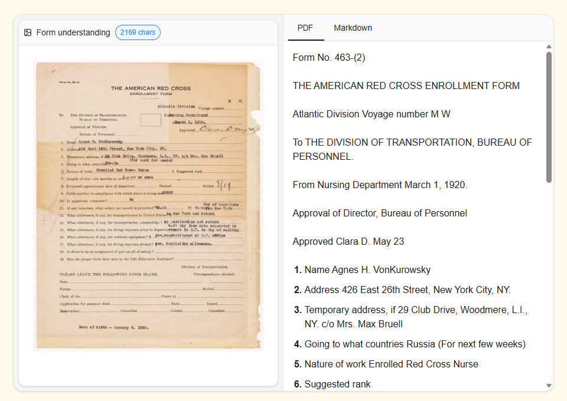
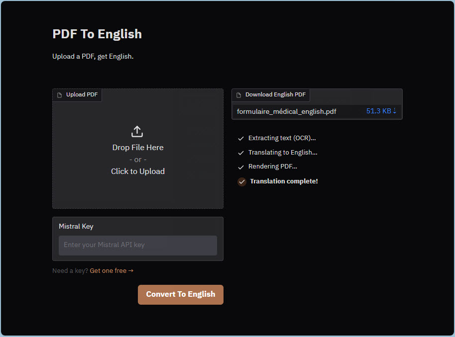

# Prototype: PDF to English (Python)

A quick spike to explore Mistral OCR: a Python Gradio app where you upload a PDF and download it translated into British English.

<div align="center">
  
  <p><em>Mistral OCR extracting from a scanned PDF</em></p>
</div>

<div align="center">
  <a href="https://pdf-to-english-prototype.up.railway.app/">
    
  </a>
  <p><em>Upload a PDF to translate to English (click image)</em></p>
</div>

The UI is simple, modelled on this [HTML mock-up](https://michellepace.github.io/pdf-to-english-py/mock-up/prototype.html). For examples, see [`input_pdfs/`](input_pdfs/) and their translations in [`output_pdfs/`](output_pdfs/).

## 🔄 PDF Pipeline Flow

```text
                    PIPELINE FLOW

┌──────────────┐
│     PDF      │  ← 🙂 User uploads
└──────┬───────┘
       │
       ▼
┌──────────────┐
│  Base64      │  ocr.py encodes file
│  Encode      │
└──────┬───────┘
       │
       ▼
┌──────────────┐     ┌──────────────────────┐ 🤖
│  Mistral     │────>│ Returns:             │
│  OCR API     │     │ • Markdown text      │
└──────┬───────┘     │ • HTML tables        │
       │             │ • Base64 images      │
       │             │ • Page + image sizes │
       ▼             └──────────────────────┘
┌──────────────┐
│  Inline      │  ocr.py replaces placeholders
│  Assets      │  with actual table/image data
└──────┬───────┘
       │
       ▼
┌──────────────┐     ┌──────────────────────┐ 🤖
│ Mistral Large│────>│ Returns:             │
│  LLM API     │     │ • British English MD │
└──────┬───────┘     │ • Structure intact   │
       │             └──────────────────────┘
       │  (images stripped before, restored after)
       ▼
┌──────────────┐
│  markdown-it │  MD → HTML                    🔧
└──────┬───────┘
       │
       ▼
┌──────────────┐
│  WeasyPrint  │  HTML + CSS → PDF             🔧
└──────┬───────┘  (page and image sizes from OCR)
       │
       ▼
┌──────────────┐
│ English PDF  │  ← 😁 User downloads
└──────────────┘
```

## ⏱️ PDF Pipeline Timing — Rough

Example timing on [input_pdfs/e2e_test.pdf](input_pdfs/e2e_test.pdf), a 2-page, multi-language test PDF with tables and images (127 KB). Each is a mean of only three runs. TOTAL covers the server-side pipeline; OCR and Translate hit the Mistral API.

`mistral-ocr-3` — 29 January 2026:

```text
Stage           Time    Share
─────────────────────────────────────────────────────
1. Encode       0.0s    ░░░░░░░░░░░░░░░░░░░░░░░░░░░░░░
2. OCR          5.0s    █████████░░░░░░░░░░░░░░░░░░░░░  29%
3. Process      0.0s    ░░░░░░░░░░░░░░░░░░░░░░░░░░░░░░
4. Translate   12.0s    █████████████████████░░░░░░░░░  70%
5. Render       0.2s    ░░░░░░░░░░░░░░░░░░░░░░░░░░░░░░   1%
─────────────────────────────────────────────────────
TOTAL          17.2s
```

`mistral-ocr-4-1` — 4 August 2026:

```text
Stage           Time    Share
─────────────────────────────────────────────────────
1. Encode       0.0s    ░░░░░░░░░░░░░░░░░░░░░░░░░░░░░░
2. OCR          4.0s    ██████░░░░░░░░░░░░░░░░░░░░░░░░  19%
3. Process      0.0s    ░░░░░░░░░░░░░░░░░░░░░░░░░░░░░░
4. Translate   16.8s    ████████████████████████░░░░░░  80%
5. Render       0.2s    ░░░░░░░░░░░░░░░░░░░░░░░░░░░░░░   1%
─────────────────────────────────────────────────────
TOTAL          21.0s
```

Observations:

- Translation dominates: 70–80% of the time goes to Mistral Large API
- OCR is second, and local work is negligible (encoding, processing, etc.)
- The two snapshots are six months apart, so differences between them reflect API latency on the day as much as the model version — not a like-for-like benchmark
- Re-running `mistral-ocr-3` alongside OCR 4 on 4 August gave 1.8s, not 5.0s — so OCR 4 was the *slower* of the two on the day
- Same model, three times faster than in January: these timings drift with conditions, not just model version

Reproduce with [scripts/pipeline_timing.py](scripts/pipeline_timing.py):

```shell
uv run scripts/pipeline_timing.py input_pdfs/e2e_test.pdf
```

## 🚀 Getting Started

1. Install the [uv package manager](https://docs.astral.sh/uv/getting-started/installation/), then clone and set up the project:

   ```shell
   git clone https://github.com/michellepace/pdf-to-english-py.git
   cd pdf-to-english-py

   uv sync                    # install dependencies into .venv/
   uv run pre-commit install  # run quality checks before each commit
   ```

2. Create a `.env` file in the project root with your [Mistral API key](https://admin.mistral.ai/organization/api-keys) (free):

   ```shell
   MISTRAL_API_KEY=your_api_key_here
   ```

3. Launch the app:

   ```shell
   uv run pdf-to-english
   ```

   This opens a Gradio web interface at `http://localhost:7860` (set `PORT` to use another port). Upload a PDF and download the English translation. The Mistral Key field is pre-filled from your `.env` file.

Working in an IDE? Install the recommended extensions from [.vscode/extensions.json](.vscode/extensions.json), point the interpreter at `.venv/bin/python`, and confirm the setup with `uv run pre-commit run --all-files`.

## 🧪 Development

```shell
uv run pytest                            # all tests
uv run pytest -m "not integration"       # offline tests only
uv run pre-commit run --all-files        # Ruff, Pyright, and pytest
```

Tests marked `integration` call the Mistral API and skip themselves when `MISTRAL_API_KEY` is unset.

Command-line alternatives to the web interface:

```shell
# Translate a PDF → output_pdfs/fr_two_columns_EN.pdf
uv run scripts/translate_pdf.py input_pdfs/fr_two_columns.pdf

# Time each pipeline stage → output_pdfs/fr_two_columns_timed.pdf
uv run scripts/pipeline_timing.py input_pdfs/fr_two_columns.pdf

# Print OCR metadata as JSON (page sizes, image bounding boxes, hyperlinks)
uv run scripts/investigate_ocr.py input_pdfs/fr_two_columns.pdf
```

## 🛠️ Under the Hood

Two Mistral API calls (🤖) do the work; everything else runs locally (🔧).

| Technology | Role |
| ------------ | --------- |
| [Mistral OCR](https://docs.mistral.ai/capabilities/document_ai/basic_ocr) (`mistral-ocr-latest`) 🤖 | PDF → markdown, with HTML tables, base64 images, and page and image sizes |
| [Mistral Large](https://docs.mistral.ai/getting-started/models/models_overview/) (`mistral-large-latest`) 🤖 | Markdown → British English, formatting and structure preserved |
| [markdown-it-py](https://github.com/executablebooks/markdown-it-py) 🔧 | Markdown → HTML, embedded HTML tables passed through unchanged |
| [WeasyPrint](https://weasyprint.org/) 🔧 | HTML + CSS → PDF, at the page size OCR reported |
| [Gradio](https://www.gradio.app/) | Web interface for uploading and downloading PDFs |
| [Atkinson Hyperlegible](https://www.brailleinstitute.org/freefont/) | Bundled font, embedded in every output PDF |
| [Python 3.14+](https://www.python.org/) with [uv](https://docs.astral.sh/uv/) | Runtime and dependency management |

Dev tooling: pytest, ruff, pyright, pre-commit, pypdf.

How that maps onto the repo:

```text
pdf-to-english-py/
├── src/pdf_to_english_py/
│   ├── ocr.py          # 1. Mistral OCR → markdown, tables and images inlined
│   ├── translate.py    # 2. Mistral Large → British English
│   ├── render.py       # 3. markdown-it-py → HTML → WeasyPrint → PDF
│   ├── app.py          # Gradio interface, drives steps 1-3
│   ├── theme.py        # Dark theme, CSS, pipeline status HTML
│   └── validate.py     # API key format and live key checks
├── scripts/            # Translate, time, and inspect OCR from the CLI
├── tests/              # Mirrors src/, plus an end-to-end pipeline test
├── fonts/              # Atkinson Hyperlegible, embedded in output PDFs
├── input_pdfs/         # Test PDFs, prefixed by language
├── output_pdfs/        # Their translated output
├── mock-up/            # Standalone HTML sketch of the interface
├── images/             # Screenshots for this README
├── xdocs/              # Stale working notes: spec, deployment, etc.
├── Procfile            # Railway process definition
├── run.py              # Deployment entry point
└── requirements.txt    # Build input, generated from pyproject.toml
```

Pushing to `main` auto-deploys to [Railway](https://pdf-to-english-prototype.up.railway.app/): the `Procfile` runs `run.py`, built from `requirements.txt`, which a pre-commit hook regenerates from `pyproject.toml`. In the deployed app, the Mistral Key field starts empty so each visitor supplies their own key.
